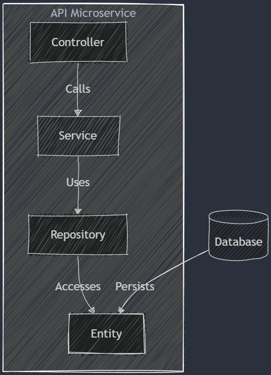

# Store API

This is a RESTful API for managing store data. It includes endpoints for managing customers, suppliers, products, orders, and contacts.

## Customers

* `GET /customers`: Retrieves a list of all customers.
* `GET /customers/:id`: Retrieves a customer by ID.
* `POST /customers`: Creates a new customer.
* `PUT /customers/:id`: Updates a customer.
* `DELETE /customers/:id`: Deletes a customer.

## Suppliers

* `GET /suppliers`: Retrieves a list of all suppliers.
* `GET /suppliers/:id`: Retrieves a supplier by ID.
* `POST /suppliers`: Creates a new supplier.
* `PUT /suppliers/:id`: Updates a supplier.
* `DELETE /suppliers/:id`: Deletes a supplier.

## Products

* `GET /products`: Retrieves a list of all products.
* `GET /products/:id`: Retrieves a product by ID.
* `POST /products`: Creates a new product.
* `PUT /products/:id`: Updates a product.
* `DELETE /products/:id`: Deletes a product.

## Orders

* `GET /orders`: Retrieves a list of all orders.
* `GET /orders/:id`: Retrieves an order by ID.
* `POST /orders`: Creates a new order.
* `PUT /orders/:id`: Updates an order.
* `DELETE /orders/:id`: Deletes an order.

## Contacts

* `GET /contacts`: Retrieves a list of all contacts.
* `GET /contacts/:id`: Retrieves a contact by ID.
* `POST /contacts`: Creates a new contact.
* `PUT /contacts/:id`: Updates a contact.
* `DELETE /contacts/:id`: Deletes a contact.

## Running the application

To run the application, execute the following command in the root directory of the project:

```bash
go run main.go
```

## Application's architeture
The following diagram shows the architecture of the project, following the flow of the request through the different layers:

## Microservice Architecture Diagram

### Here's an example of architeture

Below is a diagram representing a simple API microservice architecture following the pattern: controllers > services > repositories > entities.



Explanation

- Controller: Handles HTTP requests and responses.

- Service: Contains business logic and calls the repository.

- Repository: Manages data access and queries.

- Entity: Represents the domain model stored in the database.

This structure ensures separation of concerns and maintainability in a microservice-based API.