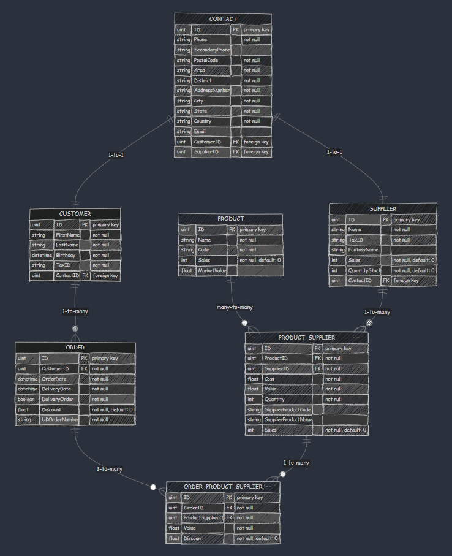

# Entities

This folder contains all entities that are used in the application.

## Contact

Represents contact information for a customer or supplier.

* Table name: contacts

## Customer

Represents a customer in the system.

* Table name: customers

## Order

Represents an order placed by a customer.

* Table name: orders

## OrderProductSupplier

Represents the association between orders, products, and suppliers.

* Table name: order_product_suppliers

## Product

Represents a product sold by a supplier.

* Table name: products

## ProductSupplier

Represents the association between products and suppliers (offering specific products).

* Table name: product_suppliers

## Supplier

Represents a supplier of products.

* Table name: suppliers

# Diagram about all entities

